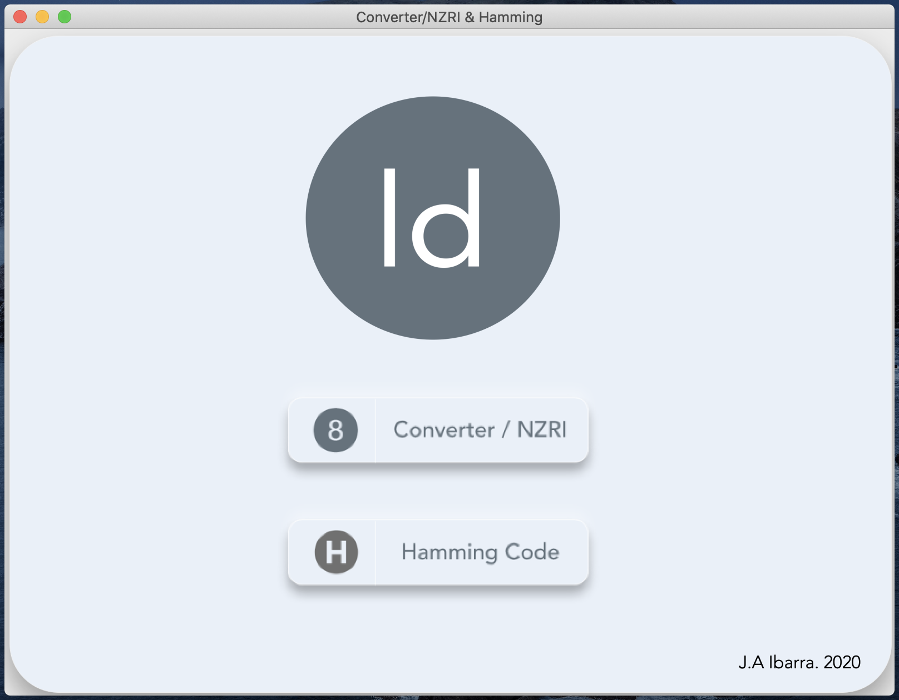
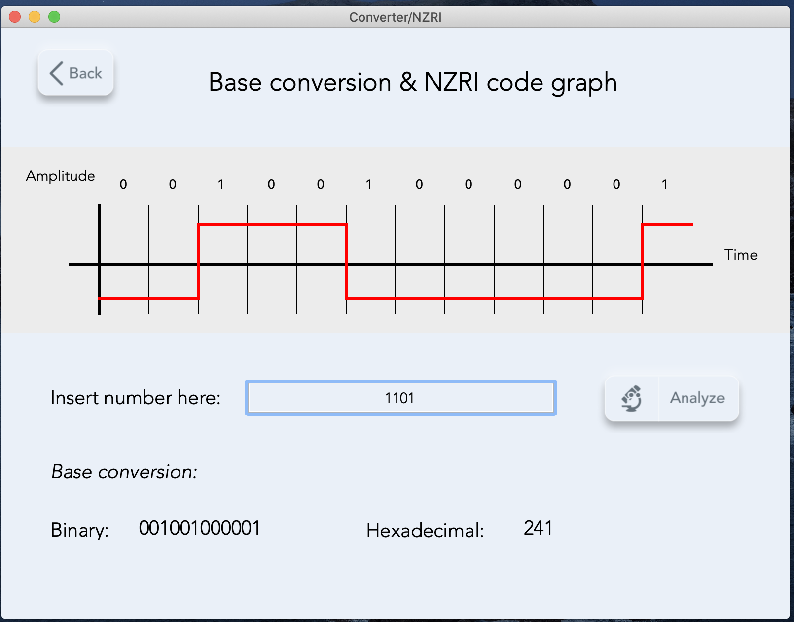
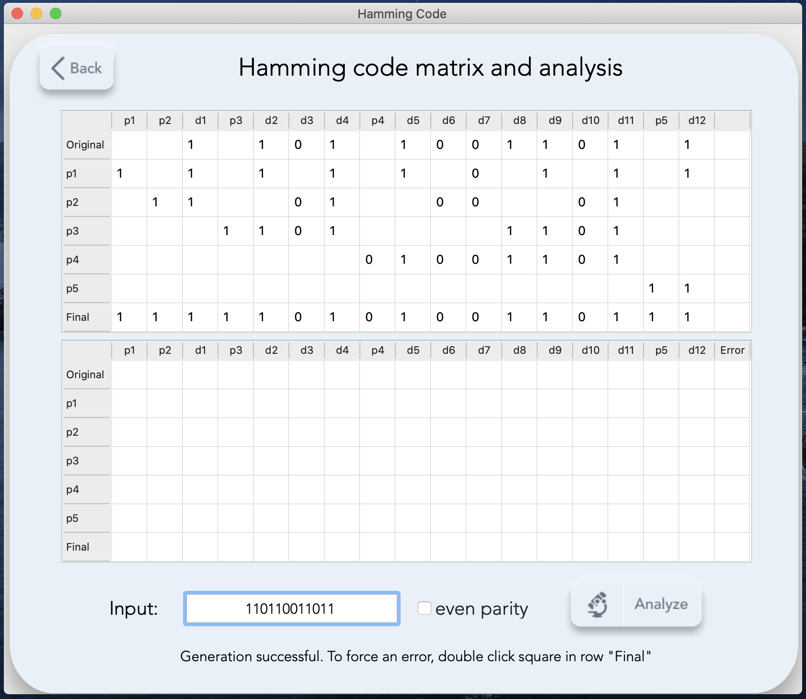
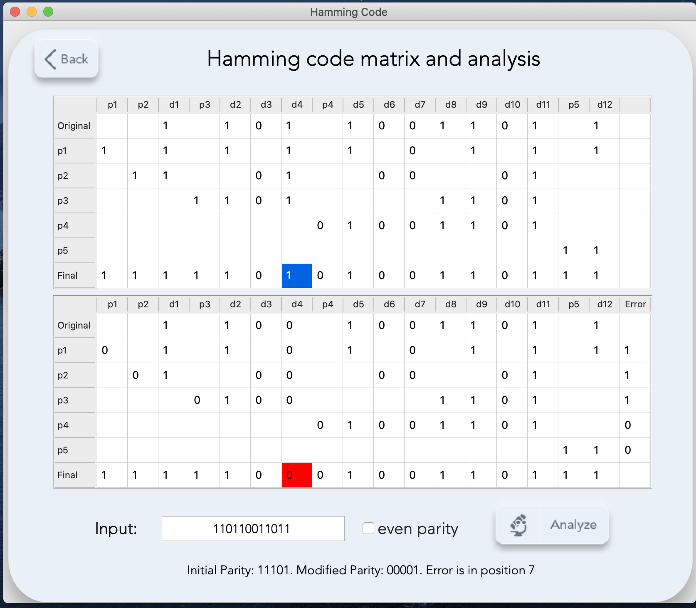

# HammingNZRI

**HammingNZRI** is a simple Qt graphical app for exemplifying common behaviour of some features pertaining logical circuit design concepts. The app has a simple neumorphic look with icons and raised buttons. It runs on the GUI framwork Qt 5 for C++. It features two major views that showcase different things.

### Base Converter/NZRI

Takes an 4 digit number in octal form and shows the equivalent in binary and hexadecimal form. At the top there's a graphical representation of the NZRI square ignal, assuming the starting value has a negative amplitude.

### Hamming Code

Takes a 12 digit binary number and draws a matrix following the rules of Hamming code error correction. You can set even or odd parity with a checkbox, and then double click on the bit you want to force an error. The app will generate the corresponding matrix that represents the algorithm to find the error position. For more information about Hamming code analysis refer to external online documentation, this is merely a graphical, automated way to see the process in action.

## Photos

Start                        |Converter/NZRI                      |
:------------------------------:|:------------------------------:
  |  

Hamming Code                       |Hamming Code with error              |
:-------------------------:|:-------------------------:
  |  

## Getting Started

These instructions will get you a copy of the project up and running on your local machine for development and testing purposes.

### Prerequisites

What things you need to install the software and how to install them

```
Qt 5.14 or higher
CMake 3.15 or higher
```

### Installing

Install Qt using your preferred method. I usually just download the installer found in the official website and select the desktop version along with Qt Creator IDE. You also need to install CMake if you don't have it already to run C++ programs.

Once that's set up you can run the app using Qt Creator or an IDE of your choice. Keep in mind you may need to replace the editors CMake path with the one bundled with Qt.

An example of this is Jetbrains CLion (a very cool looking C/C++ IDE that I personally really like), to run Qt go to

Preferences -> Build, Execution and Deployment -> CMake -> CMake Options entry

Replace content with "-DCMAKE_PREFIX_PATH=(replace with path to CMake folder in Qt installation)"

The app was developed on macOS Catalina running Qt 5.14. As Qt is a cross-platform framework, it should run relatively the same on other platforms, but your mileage may vary.

## Built With

* [Qt 5](https://qt.io) - GUI Framework for C++

## Authors

* **Alejandro Ibarra** - *Developer & Designer* - [AlejandroIbarraC](https://github.com/AlejandroIbarraC)

## License

This project is licensed under the MIT License - see the [LICENSE.md](LICENSE.md) file for details

## Acknowledgments

* Medium article - [Neumorphism the right way — A 2020 Design Trend ](https://medium.com/@artofofiare/neumorphism-the-right-way-a-2020-design-trend-386e6a09040a)
* Costa Rica Institute of Technology
* Juan Carlos Jiménez Robles (a.k.a Bigotes)
* Kevin Cordero - [Skryfall](https://github.com/Skryfall)
```

